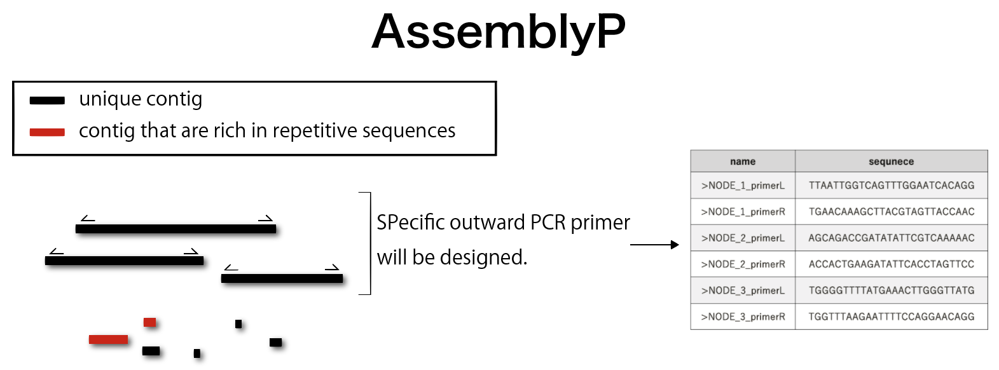

    
### Script to design outward specific primers at the end of the contig sequences.
  
Under development  

　
　

### Requirements

You must have the following installed on your system to use use this cript:  
* linux os  
* python3(>3.6)  
* primer3 (<https://github.com/primer3-org/primer3>)  
* primer3 masker (<https://github.com/bioinfo-ut/primer3_masker>)  
* bbmap (<https://github.com/BioInfoTools/BBMap>)  
* genometester4 (<https://github.com/bioinfo-ut/GenomeTester4>)  
* spades (<https://github.com/ablab/spades>)  
* biopython (<https://github.com/biopython/biopython>)  
optional  

  
  
### Without installing assemblyP (recommnended)
    mamba create -n assemblyP -y python=3
    conda activate assemblyP
    mamba install -c bioconda primer3==2.5.0 bbmap genometester4 spades==3.15 -y
    pip install biopython
    git clone git@github.com:kazumaxneo/assemblyP.git
      
    #Then, run assemblyP.py
    python assemblyP/assemblyP.py -f paired_1.fq.gz -r paired_2.fq.gz

### Install dependency and assemblyP script (developing)
    #Setup virtual enviroment using conda or mamba
    #If you already have Anaconda or Minicona enviroment, you can install mamba with conda.   
    conda install -c conda-forge mamba -y
    
    #Then, create virtual enviroment
    mamba create -n assemblyP -y python=3.9
      
    #Activate enviroment
    conda activate assemblyP
      
    #Install dependancy
    mamba install -c bioconda primer3==2.5.0 bbmap genometester4 spades==3.15 -y
        
    #Clone repository and install assemblyP package
    git clone https://github.com/kazumaxneo/assemblyP.git && cd assemblyP/
    pip install .
  
  
### help  
    $ assemblyP -h

    usage: python part1-change.py -f paired_1.fq.gz -r paired_2.fq.gz  
    Script to design outward specific primers at the end of the contig sequences (v0.1)  

    optional arguments:  
      -h, --help          show this help message and exit  
      -c <contigs.fasta>  contig fasta file  
      -f <forward reads>  paired read 1  
      -r <reverse reads>  paired read 2  
      -o PATH             output directory name  
      -k 16               K-mer size for rpeat masking.  
      -g PATH             spades contig name  
      -l PATH             glistmaker output file  
      -m PATH             repeat masked file  
      -n PATH             border sequences    
  
  

### test run
    cd test_data/
    #perform de novo aassembly and make primers
    assemblyP -f paired_1.fq.gz -r paired_2.fq.gz
    
    #make primers using preassembled sequences
    assemblyP -f paired_1.fq.gz -r paired_2.fq.gz - contigs.fasta

### Docker
Under development 

　
　
### Licence
GPL v3.

    
        

